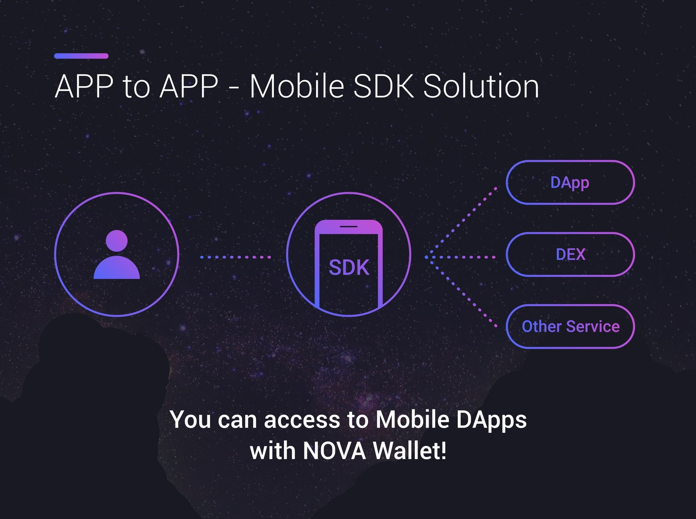

# NOVA Wallet
[Download App][1]<br>
[YouTube][5]<br>
For more information please see [the website][2].


# Gradle
```groovy
    dependencies {
        implementation 'io.eosnova:auth-sdk:1.0.0'
    }
```

# Testnet
`http://dev.cryptolions.io:38888`

[Testnet.apk][4] is required!!
```kotlin
    NovaAuth.test = true
```

# Use Activity (Optional)

If you use `Activity` instead of `AppCompatActivity`, please change `NovaAuth.class` to `NovaAuthCompat.class`.<br>
Also, `register` and `unregister` are required.

``` kotlin

    NovaAuth.class to NovaAuthCompat.class

    override fun onCreate(savedInstanceState: Bundle?) {
        super.onCreate(savedInstanceState)
        ...
        NovaAuthCompat.register(this)
        ...
    }

    override fun onDestroy() {
        super.onDestroy()
        NovaAuthCompat.unregister(this)
    }
```

# Java

please see [JavaActivity][3], [JavaCompatActivity][6].

```java

...

    // Testnet
    NovaAuth.INSTANCE.setTest(true);

    // Account
    findViewById(R.id.account).setOnClickListener(new View.OnClickListener() {
        @Override
        public void onClick(View view) {
            NovaAuth.INSTANCE.requestAccount(MainJavaActivity.this, callback);
        }
    });

    // Transfer
    findViewById(R.id.transfer).setOnClickListener(new View.OnClickListener() {
        @Override
        public void onClick(View view) {
            NovaTransfer transfer = new NovaTransfer(
                    "shinhyo", "eosio.token", "emart", 0.0001, 4, "EOS", "from EOSNOVA"
            );
            NovaAuth.INSTANCE.requestTransfer(MainJavaActivity.this, transfer, callback);
        }
    });

...

```

# Read Account Info
```kotlin
    NovaAuth.requestAccount(this, callBack)
```
# Transfer token
```kotlin
    val transfer = NovaTransfer("test2eosnova")
    transfer.contract = "eosio.token"
    transfer.to = "wzdworksnova"
    transfer.amount = 0.0001
    transfer.precision = 1          // must >= 0, minus num will replace 0
    transfer.symbol = "EOS"
    transfer.memo = "memo here"
    NovaAuth.requestTransfer(this, transfer, callBack)
```
# Stake / Unstake
```kotlin
    val stake = NovaStake("test2eosnova")
    stake.action = NovaStake.Stake.STAKE      //unstake : NovaStake.Stake.UNSTAKE
    stake.receiver = "wzdworksnova"
    stake.cpu = 1.0
    stake.net = 1.0
    stake.transfer = false
    NovaAuth.requestStake(this, stake, callBack)
```

# Make signed string
```kotlin
    val signature = NovaSignature("test2eosnova")
    signature.data = JsonObject().apply {
        addProperty("key1", "this message")
        addProperty("key2", "will")
        addProperty("key3", "be signed")
    }
    NovaAuth.requestSignature(this, signature, callBack)
```

# Push your custom actions
```kotlin
    val transfer = NovaAction("test2eosnova")
    transfer.contract = "eosio.token"
    transfer.action = "transfer"
    transfer.args = JsonObject().apply {
        addProperty("to", "wzdworksnova")
        addProperty("quantity", "1.0000 EOS")
        addProperty("memo", "memo here")
    }.toString()

    val delegatebw = NovaAction("test2eosnova")
    delegatebw.contract = "eosio"
    delegatebw.action = "delegatebw"
    delegatebw.args = JsonObject().apply {
        addProperty("receiver", "wzdworksnova")
        addProperty("stake_cpu_quantity", "1.0000 EOS")
        addProperty("stake_net_quantity", "1.0000 EOS")
        addProperty("transfer", false)
    }.toString()

    val list = ArrayList<NovaAction>()
    list.add(delegatebw)
    list.add(transfer)
    NovaAuth.requestTransaction(this, list, callBack)
```

# Callback
```kotlin
    val callBack = object : OnNovaListener {
        override fun callback(map: HashMap<String, String>) {
            val code:String? = map.get("code")
            val msg:String? = map.get("msg")  // simple response message
            val raw:String? = map.get("raw")  // success or fail response message(JSON format) from network or sdk
        }
    }
```

# Response Code
```
    0 : success
    100: User pressed 'cancel' button
    101: Parameter of your request is wrong
    200: Account list empty in nova.
    201: Can't find account in nova.
    300: Fail to push transaction. because of bad network or other reason.
    
    500: User back to dapp without any action
    501: not use yet.
```


# License 


    Copyright 2018 WizardWorks Inc. All rights reserved.

    Licensed under the Apache License, Version 2.0 (the "License");
    you may not use this file except in compliance with the License.
    You may obtain a copy of the License at

        http://www.apache.org/licenses/LICENSE-2.0

    Unless required by applicable law or agreed to in writing, software
    distributed under the License is distributed on an "AS IS" BASIS,
    WITHOUT WARRANTIES OR CONDITIONS OF ANY KIND, either express or implied.
    See the License for the specific language governing permissions and
    limitations under the License.


[1]: http://bit.ly/2CySJnr
[2]: http://bit.ly/2Lj7Bdu
[3]: https://github.com/EOSNOVA/Auth-SDK-ANDROID/blob/master/app/src/main/java/io/eosnova/wallet/android/sdk/sample/MainJavaActivity.java
[4]: https://github.com/EOSNOVA/Auth-SDK-ANDROID/blob/master/apk/nova_testnet.apk
[5]: https://www.youtube.com/watch?v=-nfbC_U9xcM
[6]: https://github.com/EOSNOVA/Auth-SDK-ANDROID/blob/master/app/src/main/java/io/eosnova/wallet/android/sdk/sample/MainJavaCompatActivity.java
